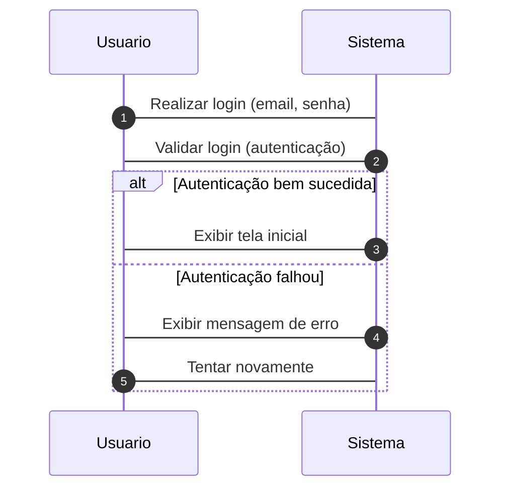

## Repositório de Diagramas do Projeto

**Descrição:**

Este repositório armazena os diagramas do projeto, incluindo:

* Diagramas de classes
* Diagramas de sequência
* Diagramas ER

**Objetivo:**

O objetivo deste repositório é centralizar os diagramas do projeto, facilitando o acesso e a compreensão da arquitetura do sistema.

**Estrutura do Repositório:**

* **Diagramas de Classes:**
    * Pasta `classes`
    * Cada diagrama em um arquivo `.png` ou `.svg`
    * Nome do arquivo deve ser descritivo do diagrama
* **Diagramas de Sequência:**
    * Pasta `sequencia`
    * Cada diagrama em um arquivo `.png` ou `.svg`
    * Nome do arquivo deve ser descritivo do diagrama
* **Diagramas ER:**
    * Pasta `er`
    * Cada diagrama em um arquivo `.png` ou `.svg`
    * Nome do arquivo deve ser descritivo do diagrama

**Exemplo de Diagrama de Classes:**

```mermaid
classDiagram
    class Usuario {
        - usuarioID: int PK
        - nome: string
        - email: string
        - telefone: string
        - tipoUsuario: string
        - permissao: string
        + realizarOrdem(ordem: Ordem)
        + fazerInscricao(inscricao: Inscricao)
        + submeterTrabalho(submissao: Submissao)
        + receberCertificado(certificado: Certificado)
        + editarPerfil()
        + alterarSenha()
        + verificarPermissao(permissao: string): bool
        + bloquearUsuario()
        + desbloquearUsuario()
        + resetarSenha()
        + enviarNotificacao(mensagem: string)
    }

    class Evento {
        - eventoID: int PK
        - nome: string
        - descricao: string
        - dataInicio: datetime
        - dataTermino: datetime
        - modalidade: string
        - limiteParticipantes: int
        + adicionarAtividade(atividade: Atividade)
        + emitirIngresso(ingresso: Ingresso)
        + gerarCertificado(certificado: Certificado)
        + editarDetalhes()
        + cancelarEvento()
        + listarInscritos(): List<Usuario>
        + listarAtividades(): List<Atividade>
        + listarIngressos(): List<Ingresso>
        + listarCertificados(): List<Certificado>
        + definirLimiteParticipantes(limite: int)
        + alterarModalidade(modalidade: string)
        + verificarPermissao(permissao: string): bool
    }

    ...
```

**Exemplo de Diagrama de Sequência:**



**Exemplo de Diagrama ER:**

```mermaid
erDiagram
    entity Usuario {
        usuarioID: int PK
        name: string
        email: string
        telefone: string
        tipoUsuario: string
        permissao: string
    }

    entity Evento {
        eventoID: int PK
        nome: string
        descricao: string
        dataInicio: datetime
        dataTermino: datetime
        modalidade: string
        limiteParticipantes: int
    }

    ...
```

**Como contribuir:**

* Crie um fork deste repositório.
* Adicione seus diagramas nas pastas correspondentes.
* Envie um pull request para o repositório principal.

**Observações:**

* Este README é apenas um exemplo. Você pode adaptá-lo para atender às suas necessidades.
* É importante manter os diagramas atualizados com as modificações no projeto.

Espero que este repositório seja útil para você organizar e compartilhar os diagramas do seu projeto!
