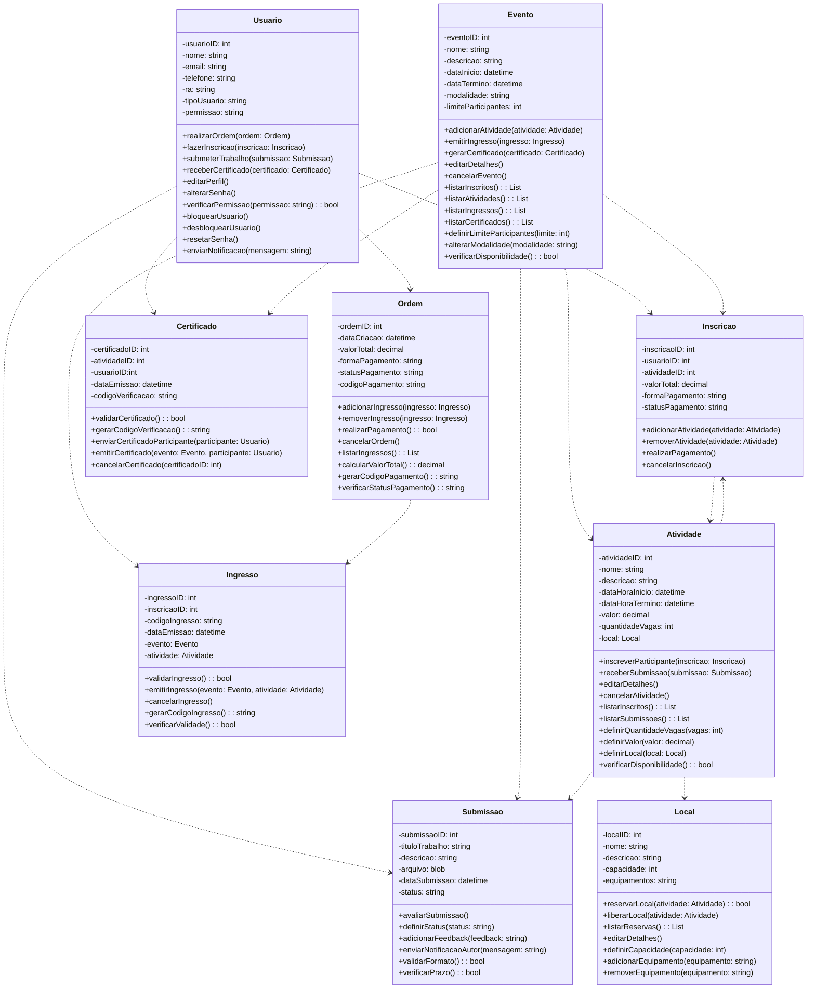
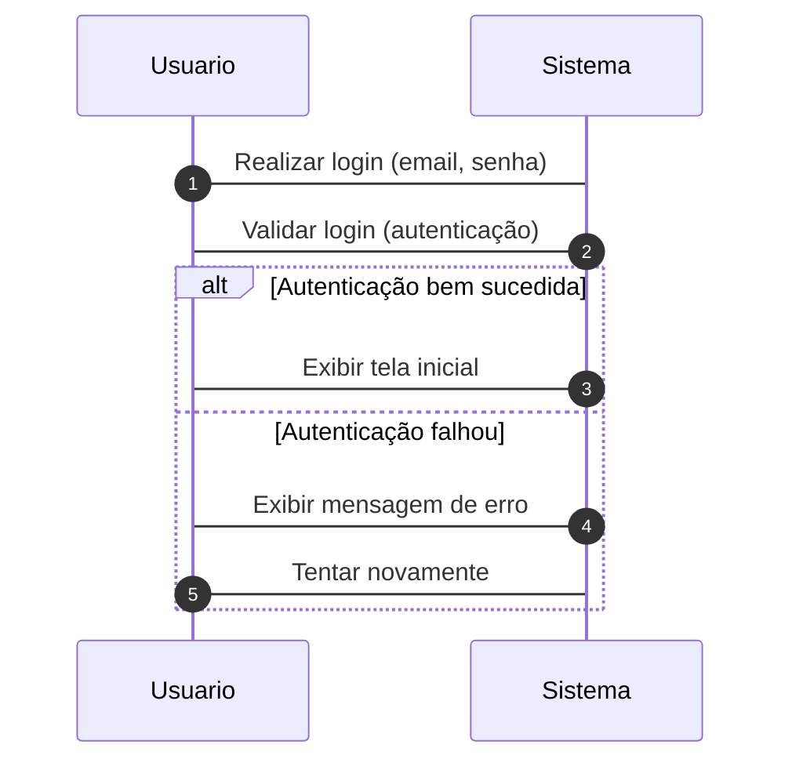
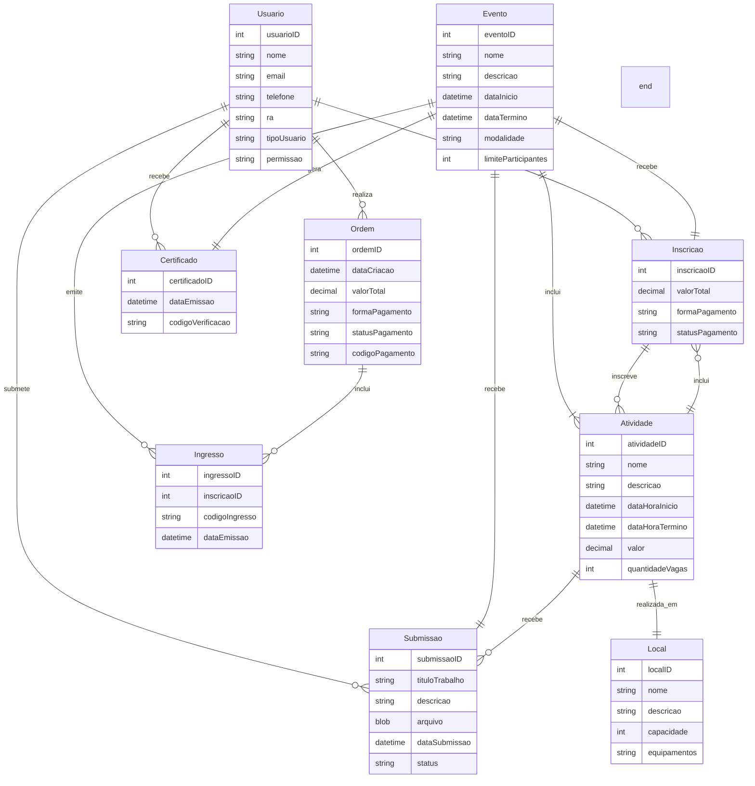

## Repositório de Diagramas do Projeto

**Descrição:**

Este repositório armazena os diagramas do projeto, incluindo:

* Diagramas de classes
* Diagramas de sequência
* Diagramas ER

**Objetivo:**

O objetivo deste repositório é centralizar os diagramas do projeto, facilitando o acesso e a compreensão da arquitetura do sistema.

**Estrutura do Repositório:**

* **Diagramas de Classes:**
    * Pasta `classes`
    * Cada diagrama em um arquivo `.png` ou `.svg`
    * Nome do arquivo deve ser descritivo do diagrama
* **Diagramas de Sequência:**
    * Pasta `sequencia`
    * Cada diagrama em um arquivo `.png` ou `.svg`
    * Nome do arquivo deve ser descritivo do diagrama
* **Diagramas ER:**
    * Pasta `er`
    * Cada diagrama em um arquivo `.png` ou `.svg`
    * Nome do arquivo deve ser descritivo do diagrama

**Diagrama de Classes:**

**Diagrama de Sequência:**

**Diagrama ER:**

